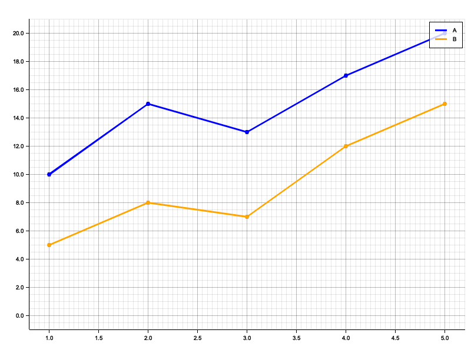
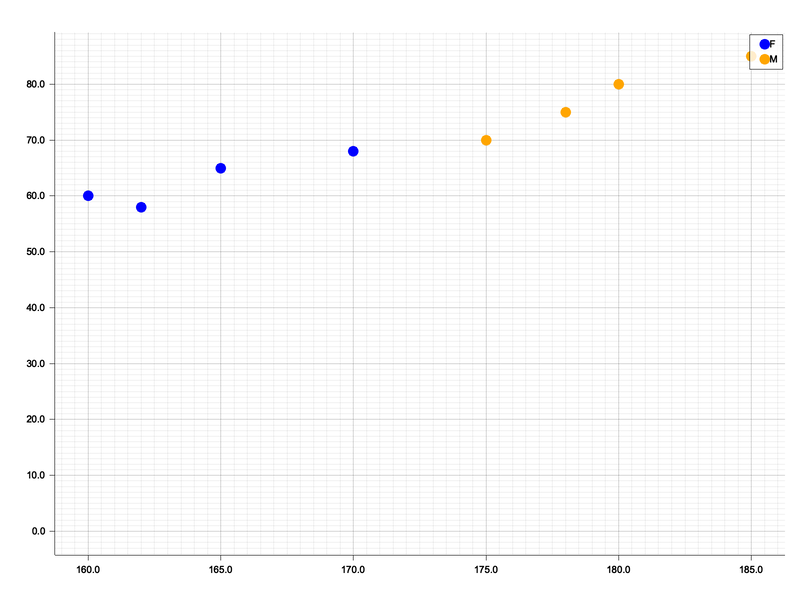
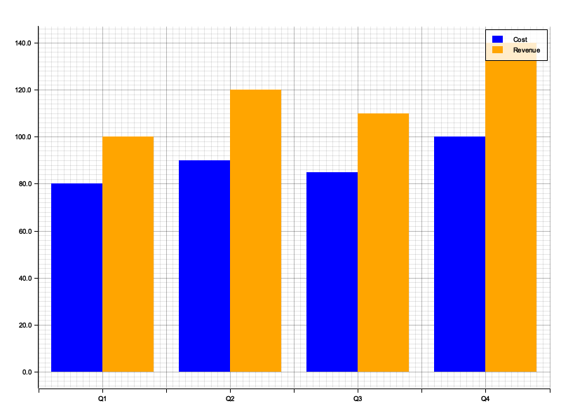
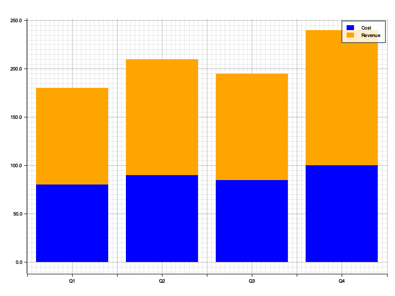

# GramGraph

A command-line tool for plotting data from CSV files using a grammar of graphics syntax.

## Usage

Pipe CSV data into `gramgraph` and provide a plot specification.

```bash
cat data.csv | gramgraph 'aes(x: time, y: value) | line()' > output.png
```

## Examples

### Grouped Line Chart

```bash
cat examples/timeseries.csv | gramgraph 'aes(x: time, y: value, color: series) | line() | point()' > examples/line_grouped.png
```



### Scatter Plot

```bash
cat examples/demographics.csv | gramgraph 'aes(x: height, y: weight, color: gender) | point(size: 5)' > examples/scatter.png
```



### Dodged Bar Chart

```bash
cat examples/financials.csv | gramgraph 'aes(x: quarter, y: amount, color: type) | bar(position: "dodge")' > examples/bar_dodge.png
```



### Stacked Bar Chart

```bash
cat examples/financials.csv | gramgraph 'aes(x: quarter, y: amount, color: type) | bar(position: "stack")' > examples/bar_stack.png
```



## Installation

```bash
cargo install --path .
```
