# GramGraph

A command-line tool for plotting data from CSV files using a grammar of graphics syntax.

## Usage

Pipe CSV data into `gramgraph` and provide a plot specification.

```bash
cat data.csv | gramgraph 'aes(x: time, y: value) | line()' --format svg > output.svg
```

## Examples

### Grouped Line Chart

```bash
cat examples/timeseries.csv | gramgraph 'aes(x: time, y: value, color: series) | line() | point() | theme_minimal()' --format svg > examples/line_grouped.svg
```


### Datetime Scale

Use `scale_x_datetime()` for ISO/RFC3339-like datetime strings. `interval` controls the tick spacing, and `format` uses chrono/strftime-style date labels.

```bash
cat examples/weather_hourly.csv | gramgraph 'aes(x: time, y: temp) | line() | point() | theme_minimal() | scale_x_datetime(interval: "20h", format: "%b %-d %H:%M")' --format svg > examples/weather_datetime.svg
```

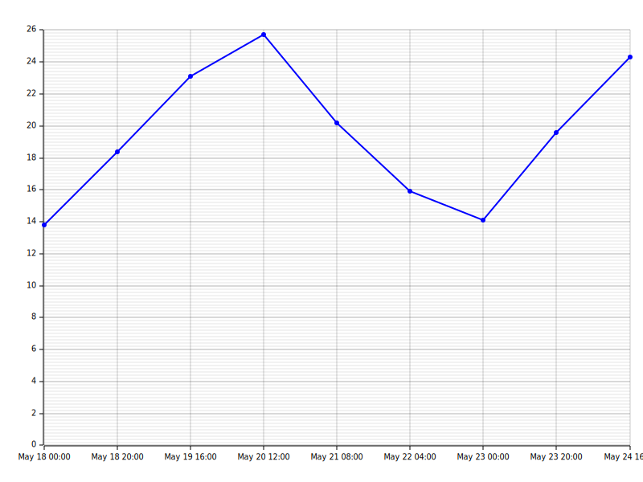

### Scatter Plot

```bash
cat examples/demographics.csv | gramgraph 'aes(x: height, y: weight, color: gender) | point(size: 5) | theme_minimal()' --format svg > examples/scatter.svg
```


### Shape and Alpha Mapping

```bash
cat examples/demographics.csv | gramgraph 'aes(x: height, y: weight, shape: gender, alpha: gender) | point(size: 7, color: "steelblue") | labs(title: "Shape and Alpha Mapping", x: "Height (cm)", y: "Weight (kg)") | theme_minimal()' --format svg > examples/shape_alpha.svg
```

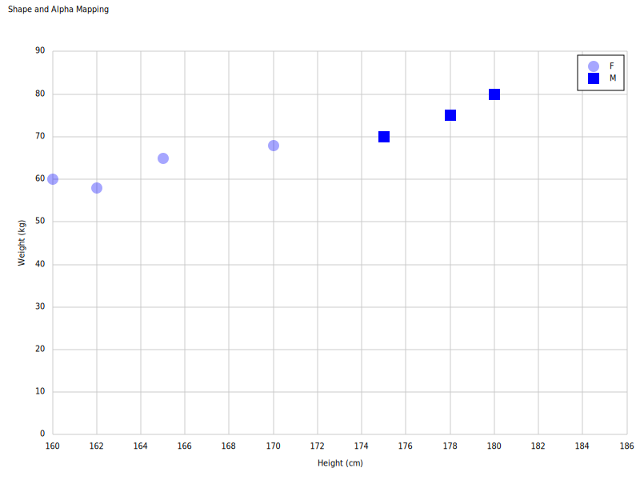

### Dodged Bar Chart

```bash
cat examples/financials.csv | gramgraph 'aes(x: quarter, y: amount, color: type) | bar(position: "dodge") | theme_minimal()' --format svg > examples/bar_dodge.svg
```


### Stacked Bar Chart

```bash
cat examples/financials.csv | gramgraph 'aes(x: quarter, y: amount, color: type) | bar(position: "stack") | theme_minimal()' --format svg > examples/bar_stack.svg
```


### Triple Dodged Bar Chart

```bash
cat examples/financials_triple.csv | gramgraph 'aes(x: quarter, y: amount, color: type) | bar(position: "dodge") | theme_minimal()' --format svg > examples/bar_triple_dodge.svg
```


### Triple Stacked Bar Chart

```bash
cat examples/financials_triple.csv | gramgraph 'aes(x: quarter, y: amount, color: type) | bar(position: "stack") | theme_minimal()' --format svg > examples/bar_triple_stack.svg
```


### Faceted Plot with Color Grouping

```bash
cat examples/regional_sales.csv | gramgraph 'aes(x: time, y: sales, color: product) | line() | facet_wrap(by: region) | theme_minimal()' --format svg > examples/facets.svg
```


### Histogram with Theme

```bash
cat examples/distribution.csv | gramgraph 'aes(x: value) | histogram(bins: 25) | labs(title: "Distribution Analysis", x: "Value", y: "Count") | theme_minimal()' --format svg > examples/histogram.svg
```


### Frequency Polygon

```bash
cat examples/distribution.csv | gramgraph 'aes(x: value) | freqpoly(bins: 25, color: "steelblue", width: 2) | labs(title: "Frequency Polygon", x: "Value", y: "Count") | theme_minimal()' --format svg > examples/freqpoly.svg
```

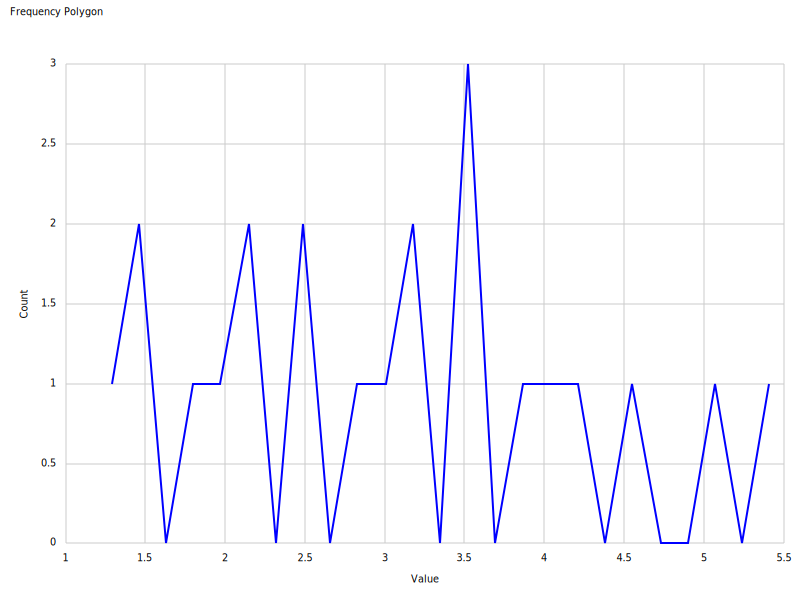

### Rug Plot

```bash
cat examples/demographics.csv | gramgraph 'aes(x: height, y: weight) | point(alpha: 0.35, color: "steelblue", size: 4) | rug(sides: "bl", color: "gray35", alpha: 0.55, length: 0.04) | labs(title: "Scatter Plot with Rug Marks", x: "Height (cm)", y: "Weight (kg)") | theme_minimal()' --format svg > examples/rug.svg
```

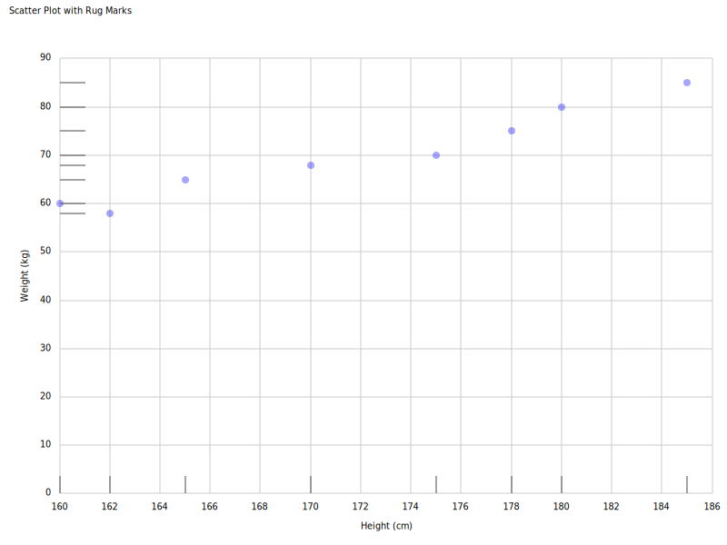

### Horizontal Bar Chart (Coord Flip)

```bash
cat examples/financials.csv | gramgraph 'aes(x: quarter, y: amount, color: type) | bar(position: "dodge") | coord_flip() | labs(title: "Financials (Horizontal)", subtitle: "Q1-Q4 Performance") | theme_minimal()' --format svg > examples/coord_flip.svg
```


### Ribbon Chart

```bash
cat examples/ribbon_data.csv | gramgraph 'aes(x: x, y: y, ymin: lower, ymax: upper) | ribbon(color: "blue", alpha: 0.3) | line(color: "blue") | labs(title: "Model Prediction", caption: "Shaded area represents 95% CI") | theme_minimal()' --format svg > examples/ribbon.svg
```


### Area Chart

```bash
cat examples/timeseries.csv | gramgraph 'aes(x: time, y: value, color: series) | area(alpha: 0.25, baseline: 0) | line(width: 2) | labs(title: "Area Chart", x: "Time", y: "Value") | theme_minimal()' --format svg > examples/area.svg
```

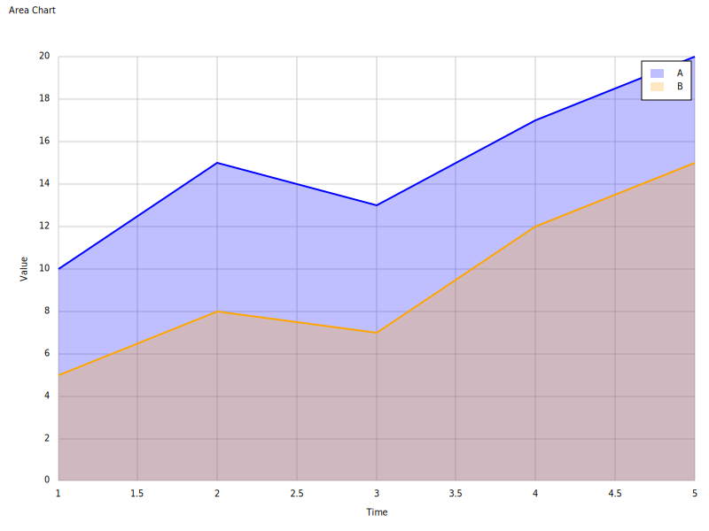

### Spike Plot

```bash
cat examples/timeseries.csv | gramgraph 'aes(x: time, y: value, color: series) | spike(baseline: 0, width: 1.5, alpha: 0.65) | point(size: 3) | labs(title: "Spike Plot", x: "Time", y: "Value") | theme_minimal()' --format svg > examples/spike.svg
```

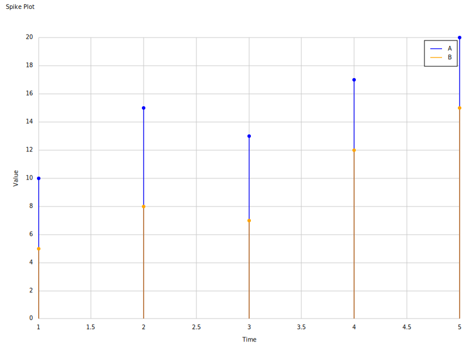

### Step Line Chart

```bash
cat examples/timeseries.csv | gramgraph 'aes(x: time, y: value, color: series) | step(direction: "mid", width: 2) | point(size: 4) | labs(title: "Step Line Chart", x: "Time", y: "Value") | theme_minimal()' --format svg > examples/step.svg
```

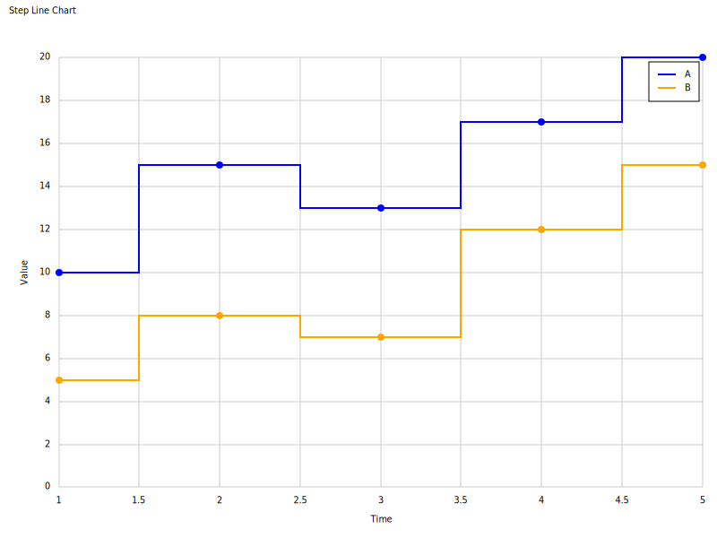

### Reference Lines

```bash
cat examples/timeseries.csv | gramgraph 'aes(x: time, y: value, color: series) | line() | hline(yintercept: 12, color: "red", width: 2, alpha: 0.8, label: "Target y = 12") | vline(xintercept: 3, color: "gray40", width: 2, label: "Time marker x = 3") | labs(title: "Reference Lines", x: "Time", y: "Value") | theme_minimal() | theme(legend_position: "bottom")' --format svg > examples/reference_lines.svg
```

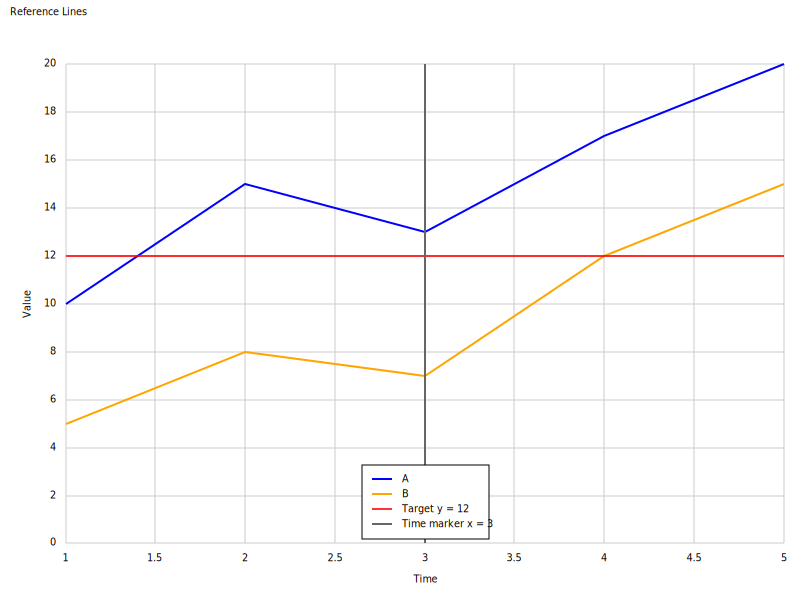

### Abline and Segment

```bash
cat examples/demographics.csv | gramgraph 'aes(x: height, y: weight, color: gender) | point(alpha: 0.55, size: 5) | abline(slope: 1, intercept: -100, color: "gray30", width: 2, label: "Reference trend") | segment(x: 160, y: 55, xend: 185, yend: 85, color: "red", width: 2, label: "Manual segment") | labs(title: "Abline and Segment", x: "Height (cm)", y: "Weight (kg)") | theme_minimal() | theme(legend_position: "bottom")' --format svg > examples/abline_segment.svg
```

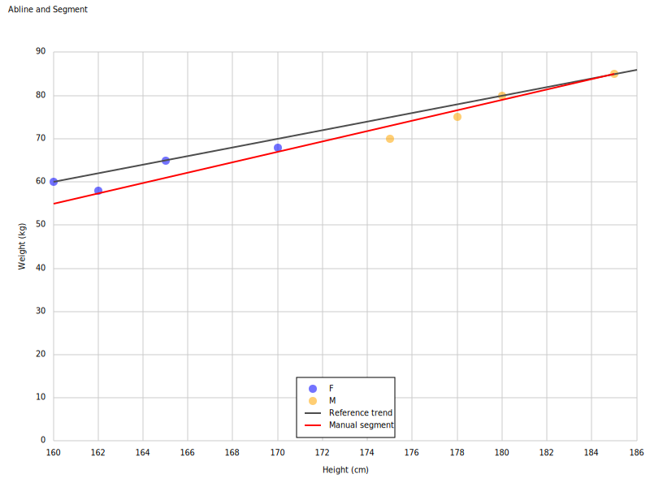

### Line Range

```bash
cat examples/intervals.csv | gramgraph 'aes(x: time, y: estimate, ymin: lower, ymax: upper, color: series) | linerange(width: 2, alpha: 0.75) | point(size: 4) | labs(title: "Line Range Intervals", x: "Time", y: "Estimate") | theme_minimal()' --format svg > examples/linerange.svg
```

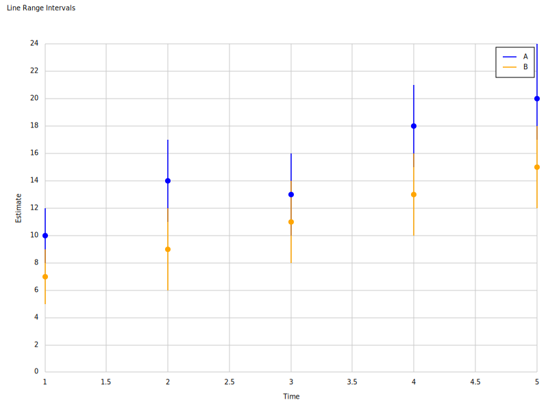

### Error Bars

```bash
cat examples/intervals.csv | gramgraph 'aes(x: time, y: estimate, ymin: lower, ymax: upper, color: series) | errorbar(width: 0.18, linewidth: 1.5, alpha: 0.75) | point(size: 4) | labs(title: "Error Bars", x: "Time", y: "Estimate") | theme_minimal()' --format svg > examples/errorbar.svg
```

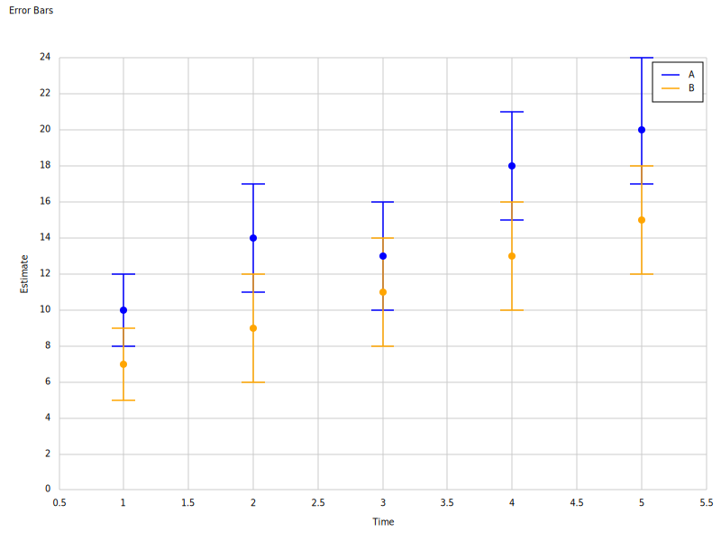

### Point Range

```bash
cat examples/intervals.csv | gramgraph 'aes(x: time, y: estimate, ymin: lower, ymax: upper, color: series) | pointrange(size: 4, width: 1.5, shape: "diamond", alpha: 0.85) | labs(title: "Point Range Intervals", x: "Time", y: "Estimate") | facet_wrap(by: series, ncol: 2) | theme_minimal()' --format svg > examples/pointrange.svg
```

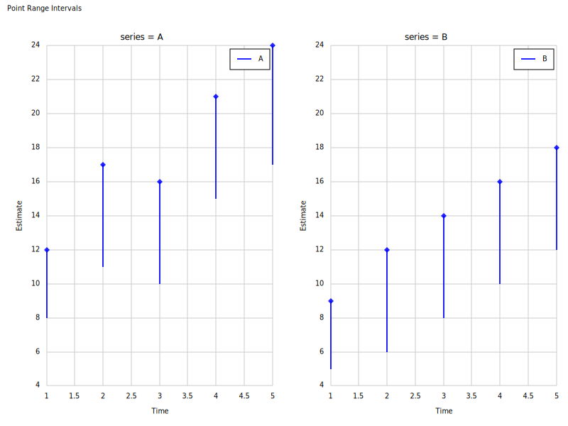

### Crossbar

```bash
cat examples/intervals.csv | gramgraph 'aes(x: time, y: estimate, ymin: lower, ymax: upper, color: series) | crossbar(width: 0.45, linewidth: 2, alpha: 0.5) | labs(title: "Crossbar Intervals", x: "Time", y: "Estimate") | facet_wrap(by: series, ncol: 2) | theme_minimal()' --format svg > examples/crossbar.svg
```

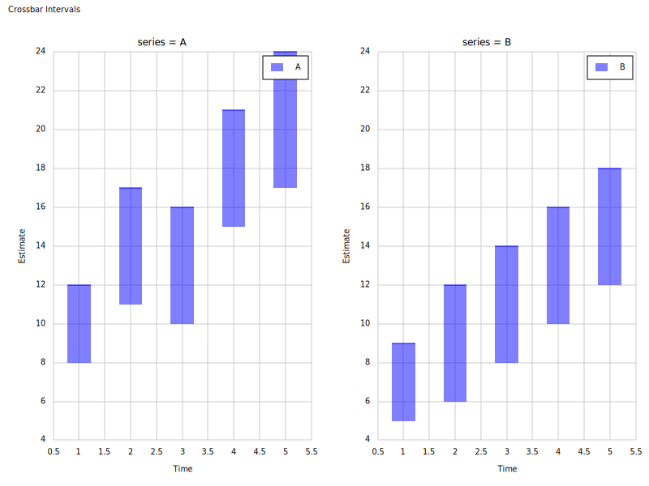

### Smoothing (Linear Regression)

```bash
cat examples/demographics.csv | gramgraph 'aes(x: height, y: weight) | point(alpha: 0.5) | smooth() | labs(title: "Height vs Weight", subtitle: "Linear Regression Fit") | theme_minimal()' --format svg > examples/smooth.svg
```


### Smoothing (LOESS)

```bash
cat examples/demographics.csv | gramgraph 'aes(x: height, y: weight) | point(alpha: 0.35) | smooth(method: "loess", span: 0.65, color: "red", width: 3) | labs(title: "Height vs Weight", subtitle: "LOESS Fit") | theme_minimal()' --format svg > examples/smooth_loess.svg
```

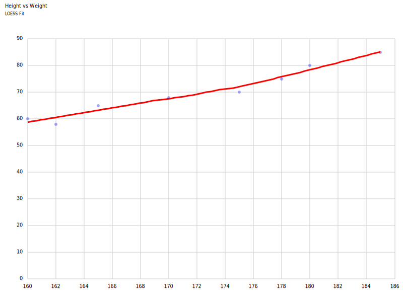

### Boxplot

```bash
cat examples/demographics.csv | gramgraph 'aes(x: gender, y: height, color: gender) | boxplot() | theme_minimal()' --format svg > examples/boxplot.svg
```


### Violin Plot

```bash
cat examples/demographics.csv | gramgraph 'aes(x: gender, y: height, color: gender) | violin(draw_quantiles: [0.25, 0.5, 0.75]) | theme_minimal()' --format svg > examples/violin.svg
```


### Density Plot

```bash
cat examples/distribution.csv | gramgraph 'aes(x: value) | density() | labs(title: "Density Estimate", x: "Value", y: "Density") | theme_minimal()' --format svg > examples/density.svg
```


### Density Plot with Color Grouping

```bash
cat examples/demographics.csv | gramgraph 'aes(x: height, color: gender) | density(alpha: 0.4) | labs(title: "Height Distribution by Gender", x: "Height (cm)", y: "Density") | theme_minimal()' --format svg > examples/density_grouped.svg
```


### Heatmap

```bash
cat examples/heatmap_data.csv | gramgraph 'aes(x: x, y: y, fill: value) | heatmap() | labs(title: "Weekly Activity Heatmap", x: "Day", y: "Time of Day") | theme_minimal()' --format svg > examples/heatmap.svg
```


### Nice Ticks (Irregular Data)

Numeric axes automatically snap to clean, human-friendly tick values even when data points fall at irregular positions.

```bash
cat examples/measurements.csv | gramgraph 'aes(x: elapsed, y: temperature) | point(color: "steelblue", size: 4) | line(color: "steelblue", alpha: 0.5) | labs(title: "Sensor Readings", subtitle: "Nice ticks from irregular sample times", x: "Elapsed Time (hrs)", y: "Temperature (C)") | theme_minimal()' --format svg > examples/nice_ticks.svg
```

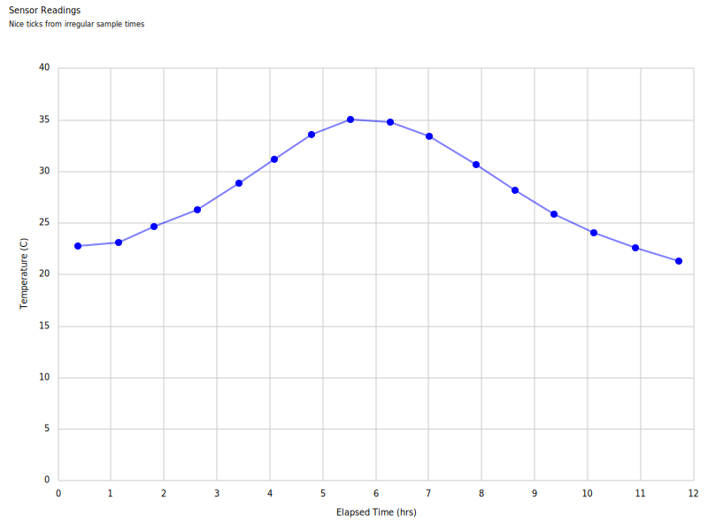

### Reverse Scale

```bash
cat examples/timeseries.csv | gramgraph 'aes(x: time, y: value, color: series) | line() | labs(title: "Reverse Time Axis") | theme_minimal() | scale_x_reverse()' --format svg > examples/scale_reverse.svg
```


### Log10 Scale

```bash
cat examples/scales.csv | gramgraph 'aes(x: x, y: value) | line(color: "steelblue", width: 2) | point(shape: "triangle", size: 6, color: "steelblue") | labs(title: "Log10 X Scale", x: "Input", y: "Value") | theme_minimal() | scale_x_log10()' --format svg > examples/scale_log10.svg
```

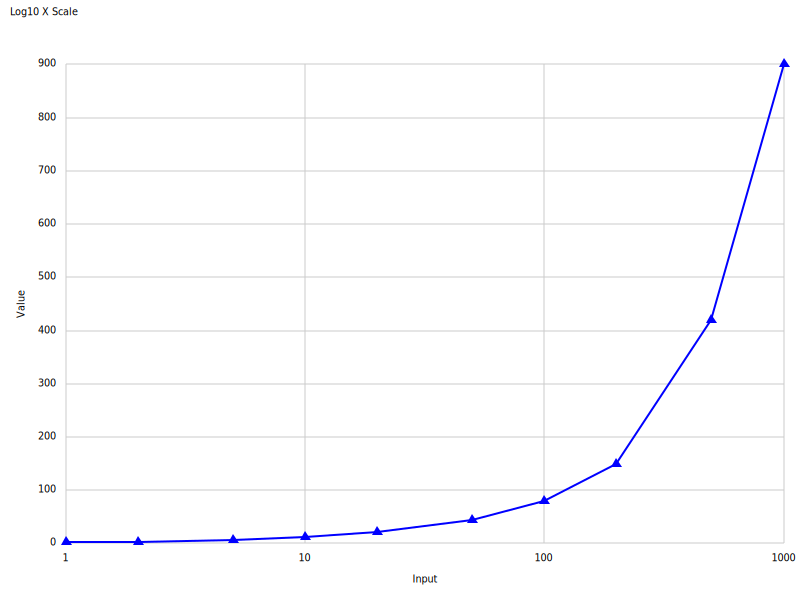

### Square Root Scale

```bash
cat examples/scales.csv | gramgraph 'aes(x: x, y: value) | line(color: "purple", width: 2) | point(shape: "diamond", size: 6, color: "purple") | labs(title: "Square Root X Scale", x: "Input", y: "Value") | theme_minimal() | scale_x_sqrt()' --format svg > examples/scale_sqrt.svg
```

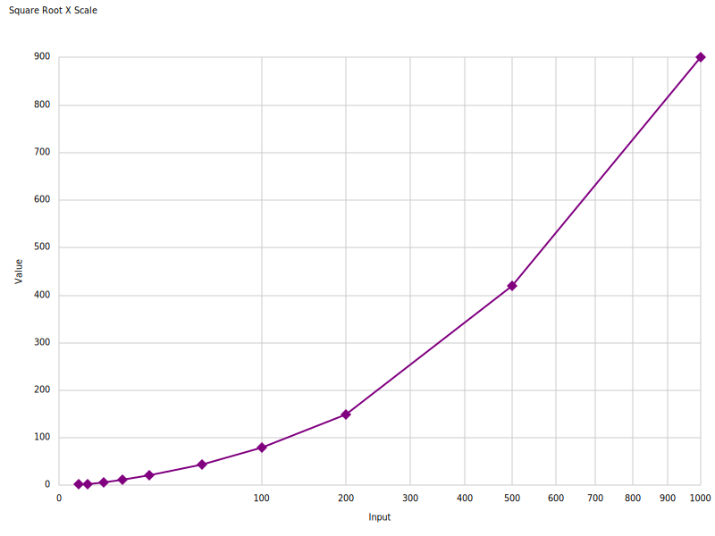

### Custom Theme with Element Functions

```bash
cat examples/timeseries.csv | gramgraph 'aes(x: time, y: value, color: series) | line() | labs(title: "Custom Styled Chart") | theme_minimal() | theme(plot_title: element_text(size: 24, color: "#2E86AB"), panel_grid_minor: element_blank(), axis_line: element_blank())' --format svg > examples/theme_custom.svg
```


### Dark Theme Example

```bash
cat examples/demographics.csv | gramgraph 'aes(x: height, y: weight, color: gender) | point(size: 5) | labs(title: "Dark Theme Example") | theme_minimal() | theme_dark()' --format svg > examples/theme_dark.svg
```


### Classic Theme Example

```bash
cat examples/financials.csv | gramgraph 'aes(x: quarter, y: amount, color: type) | bar(position: "dodge") | labs(title: "Classic Theme Example") | theme_minimal() | theme_classic()' --format svg > examples/theme_classic.svg
```


### Light Theme Example

```bash
cat examples/timeseries.csv | gramgraph 'aes(x: time, y: value, color: series) | line(width: 2) | point(size: 4) | labs(title: "Light Theme Example") | theme_minimal() | theme_light()' --format svg > examples/theme_light.svg
```

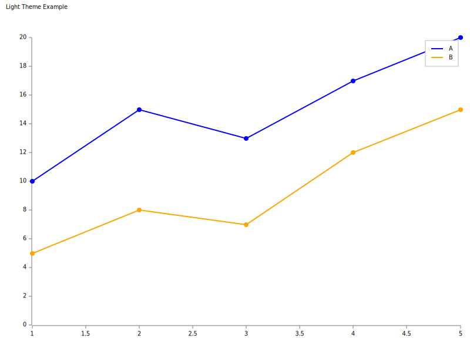

### Void Theme Example

```bash
cat examples/demographics.csv | gramgraph 'aes(x: height, y: weight, color: gender) | point(size: 5) | labs(title: "Void Theme Example") | theme_minimal() | theme_void()' --format svg > examples/theme_void.svg
```

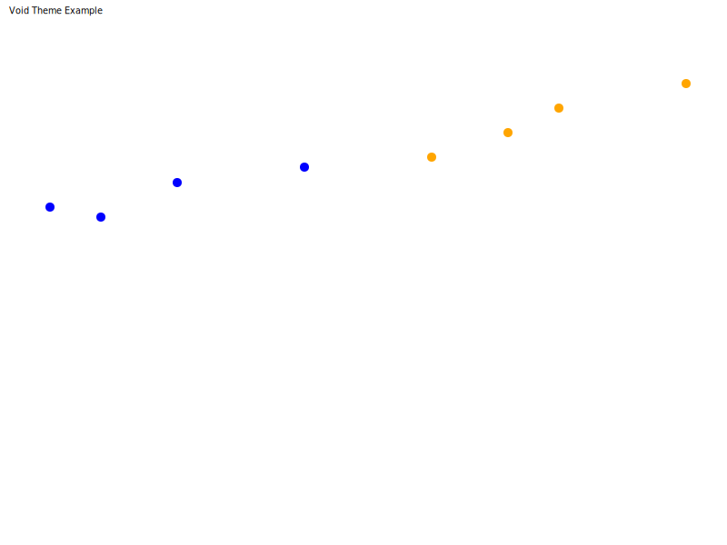

### Custom Legend

```bash
cat examples/timeseries.csv | gramgraph 'aes(x: time, y: value, color: series) | line(width: 3) | point(size: 4) | labs(title: "Custom Legend") | theme_minimal() | theme(legend_position: "bottom", legend_text: element_text(size: 14, color: "#222222"), legend_background: element_rect(fill: "#F7F7F7", color: "#333333", width: 1), legend_margin: 6, legend_key_size: 22)' --format svg > examples/legend_custom.svg
```

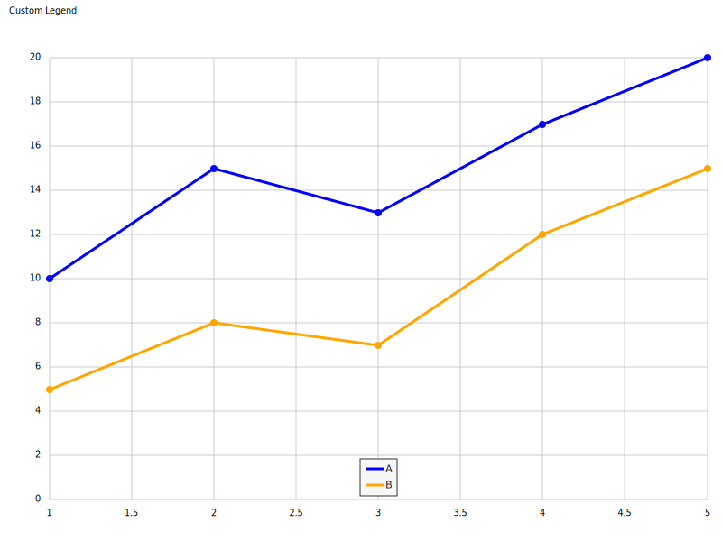

### Merged Themes

```bash
cat examples/financials.csv | gramgraph 'aes(x: quarter, y: amount, color: type) | bar(position: "dodge") | labs(title: "Merged Theme Example") | theme_minimal() | theme(plot_title: element_text(size: 20, face: "bold"))' --format svg > examples/theme_merged.svg
```


### Bold Axis Labels

```bash
cat examples/financials.csv | gramgraph 'aes(x: quarter, y: amount, color: type) | bar(position: "dodge") | labs(title: "Bold Axis Labels") | theme_minimal() | theme(axis_text: element_text(face: "bold", size: 14))' --format svg > examples/axis_bold.svg
```


### Rotated X-Axis Labels

```bash
cat examples/financials.csv | gramgraph 'aes(x: quarter, y: amount, color: type) | bar(position: "dodge") | labs(title: "Rotated X-Axis Labels") | theme_minimal() | theme(axis_text: element_text(angle: 90, size: 12))' --format svg > examples/axis_rotated.svg
```


### Hidden Ticks

```bash
cat examples/timeseries.csv | gramgraph 'aes(x: time, y: value, color: series) | line() | labs(title: "Clean Look - No Ticks") | theme_minimal() | theme(axis_ticks: element_blank())' --format svg > examples/axis_no_ticks.svg
```


### Fully Styled Axes

```bash
cat examples/regional_sales.csv | gramgraph 'aes(x: region, y: sales, color: product) | bar(position: "dodge") | labs(title: "Fully Styled Axes") | theme_minimal() | theme(axis_text: element_text(face: "bold", angle: 90, color: "#2E86AB", size: 11), axis_line: element_line(color: "#333333", width: 2))' --format svg > examples/axis_styled.svg
```


### Variable Injection

Use `-D` / `--define` to inject variables into your DSL at runtime. Variables use the `$name` syntax.

```bash
cat examples/timeseries.csv | gramgraph 'aes(x: $xcol, y: $ycol, color: series) | line() | labs(title: $title) | theme_minimal()' -D xcol=time -D ycol=value -D title="Variable Injection Example" --format svg > examples/variable_aes.svg
```


Variables work in aesthetics, geometries, and labels:

```bash
cat examples/demographics.csv | gramgraph 'aes(x: height, y: weight) | point(color: $color, size: $size) | labs(title: "Styled with Variables") | theme_minimal()' -D color=blue -D size=8 --format svg > examples/variable_geom.svg
```


## Installation

```bash
cargo install --path .
```
