# GramGraph

A command-line tool for plotting data from CSV files using a grammar of graphics syntax.

## Usage

Pipe CSV data into `gramgraph` and provide a plot specification.

```bash
cat data.csv | gramgraph 'aes(x: time, y: value) | line()' --format svg > output.svg
```

## Examples

### Grouped Line Chart

```bash
cat examples/timeseries.csv | gramgraph 'aes(x: time, y: value, color: series) | line() | point()' --format svg > examples/line_grouped.svg
```

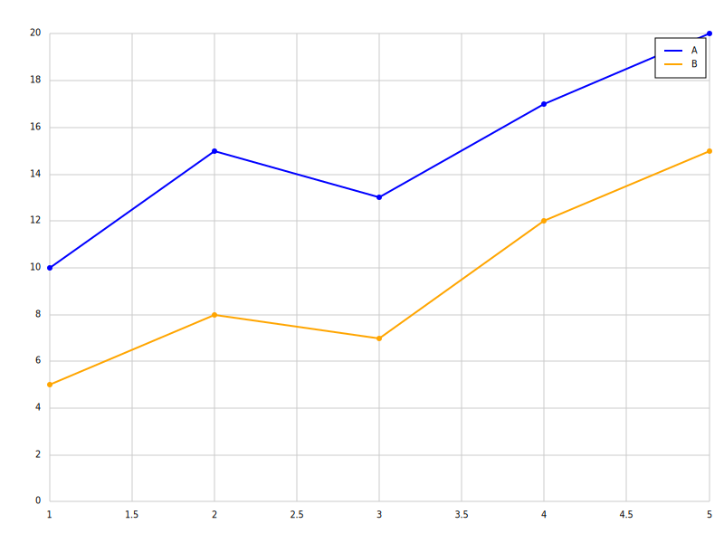

### Scatter Plot

```bash
cat examples/demographics.csv | gramgraph 'aes(x: height, y: weight, color: gender) | point(size: 5)' --format svg > examples/scatter.svg
```

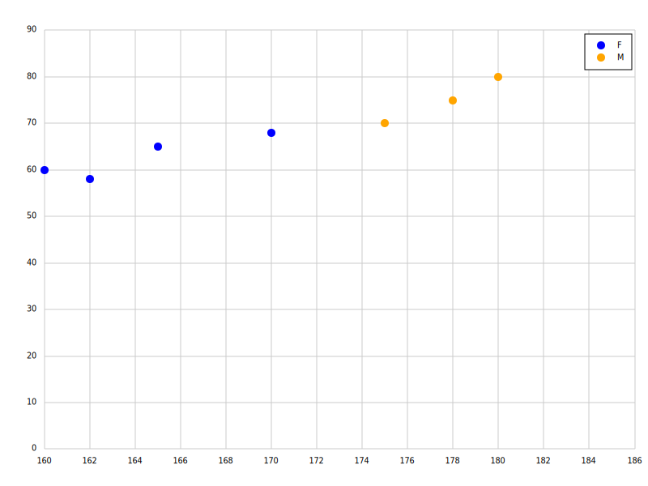

### Dodged Bar Chart

```bash
cat examples/financials.csv | gramgraph 'aes(x: quarter, y: amount, color: type) | bar(position: "dodge")' --format svg > examples/bar_dodge.svg
```

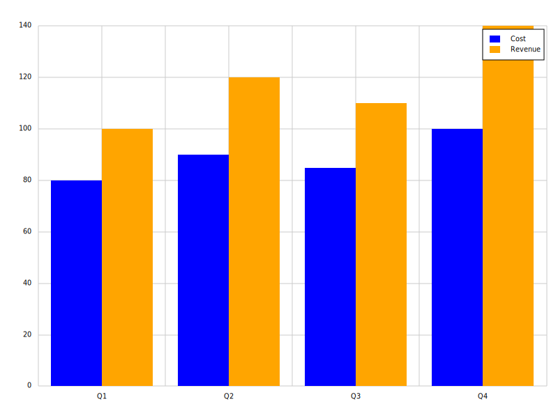

### Stacked Bar Chart

```bash
cat examples/financials.csv | gramgraph 'aes(x: quarter, y: amount, color: type) | bar(position: "stack")' --format svg > examples/bar_stack.svg
```

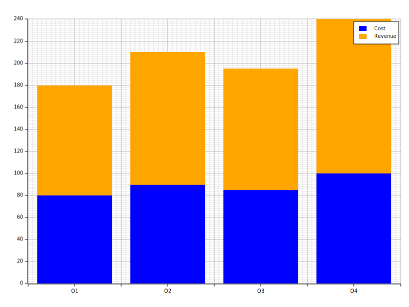

### Triple Dodged Bar Chart

```bash
cat examples/financials_triple.csv | gramgraph 'aes(x: quarter, y: amount, color: type) | bar(position: "dodge")' --format svg > examples/bar_triple_dodge.svg
```

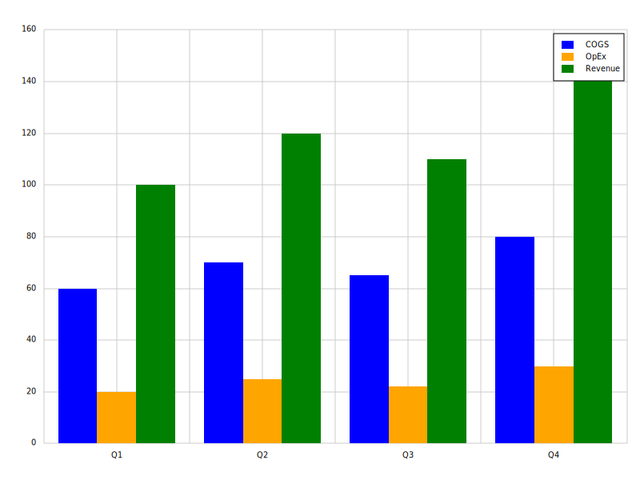

### Triple Stacked Bar Chart

```bash
cat examples/financials_triple.csv | gramgraph 'aes(x: quarter, y: amount, color: type) | bar(position: "stack")' --format svg > examples/bar_triple_stack.svg
```

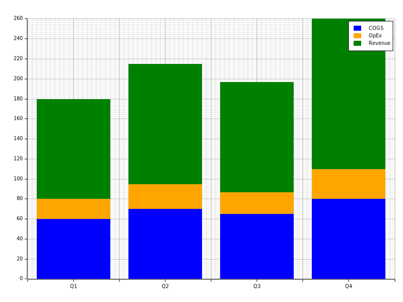

### Faceted Plot with Color Grouping

```bash
cat examples/regional_sales.csv | gramgraph 'aes(x: time, y: sales, color: product) | line() | facet_wrap(by: region)' --format svg > examples/facets.svg
```

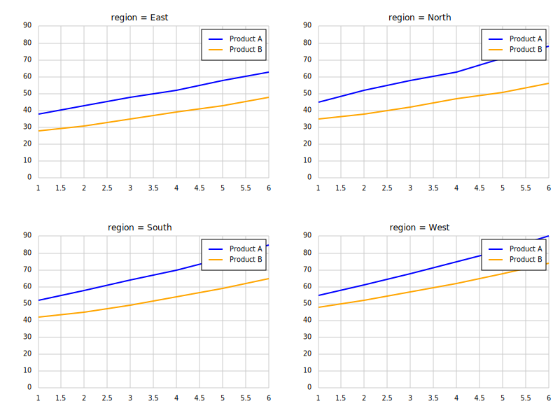

### Histogram with Theme

```bash
cat examples/distribution.csv | gramgraph 'aes(x: value) | histogram(bins: 25) | labs(title: "Distribution Analysis", x: "Value", y: "Count") | theme_minimal()' --format svg > examples/histogram.svg
```

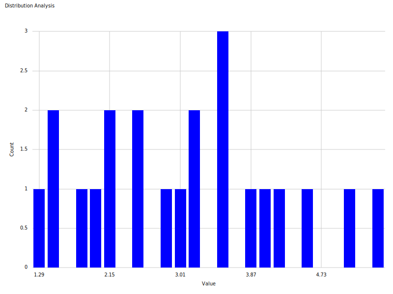

### Horizontal Bar Chart (Coord Flip)

```bash
cat examples/financials.csv | gramgraph 'aes(x: quarter, y: amount, color: type) | bar(position: "dodge") | coord_flip() | labs(title: "Financials (Horizontal)", subtitle: "Q1-Q4 Performance")' --format svg > examples/coord_flip.svg
```

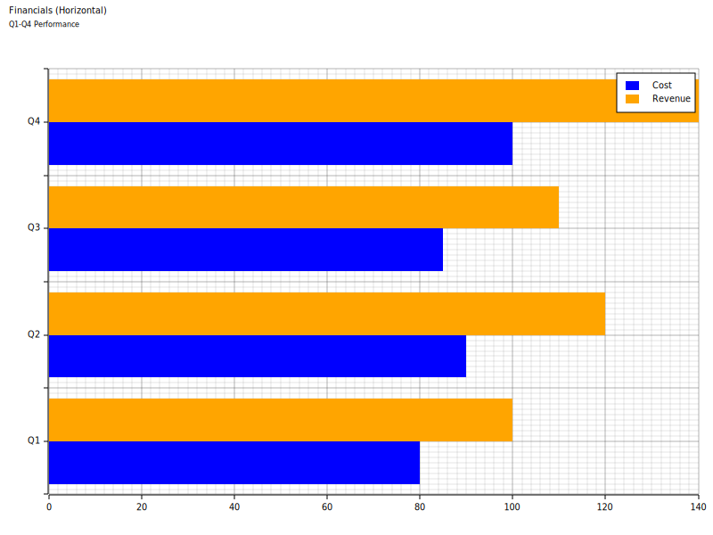

### Ribbon Chart

```bash
cat examples/ribbon_data.csv | gramgraph 'aes(x: x, y: y, ymin: lower, ymax: upper) | ribbon(color: "blue", alpha: 0.3) | line(color: "blue") | labs(title: "Model Prediction", caption: "Shaded area represents 95% CI") | theme_minimal()' --format svg > examples/ribbon.svg
```

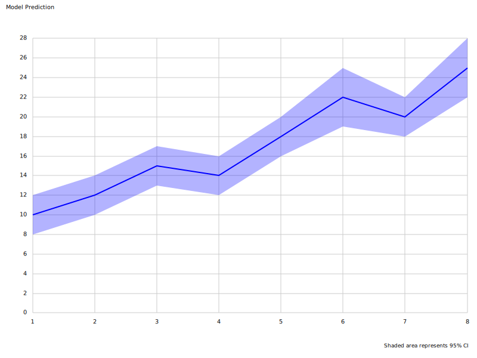

### Smoothing (Linear Regression)

```bash
cat examples/demographics.csv | gramgraph 'aes(x: height, y: weight) | point(alpha: 0.5) | smooth() | labs(title: "Height vs Weight", subtitle: "Linear Regression Fit")' --format svg > examples/smooth.svg
```

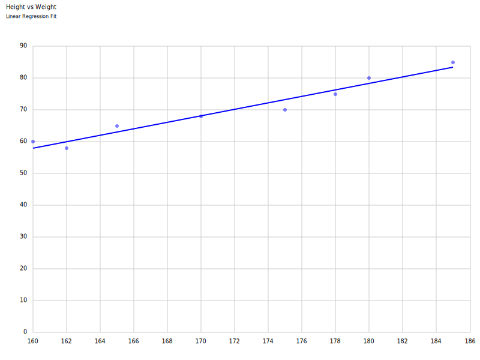

### Boxplot

```bash
cat examples/demographics.csv | gramgraph 'aes(x: gender, y: height, color: gender) | boxplot()' --format svg > examples/boxplot.svg
```

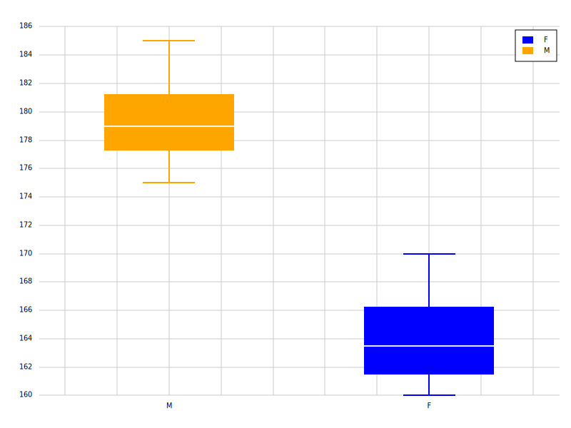

### Violin Plot

```bash
cat examples/demographics.csv | gramgraph 'aes(x: gender, y: height, color: gender) | violin(draw_quantiles: [0.25, 0.5, 0.75]) | theme_minimal()' --format svg > examples/violin.svg
```

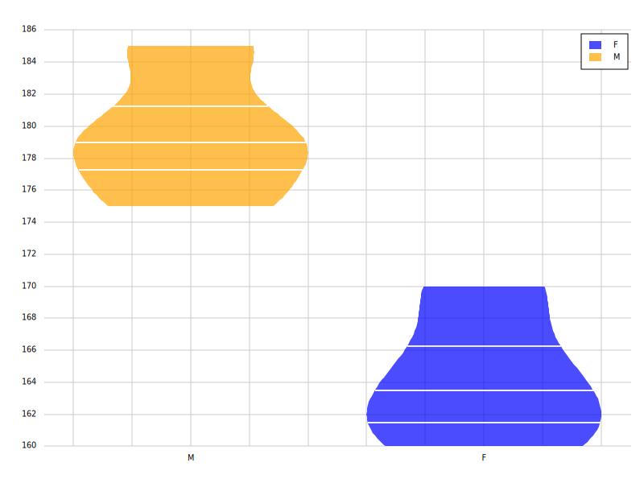

### Density Plot

```bash
cat examples/distribution.csv | gramgraph 'aes(x: value) | density() | labs(title: "Density Estimate", x: "Value", y: "Density") | theme_minimal()' --format svg > examples/density.svg
```

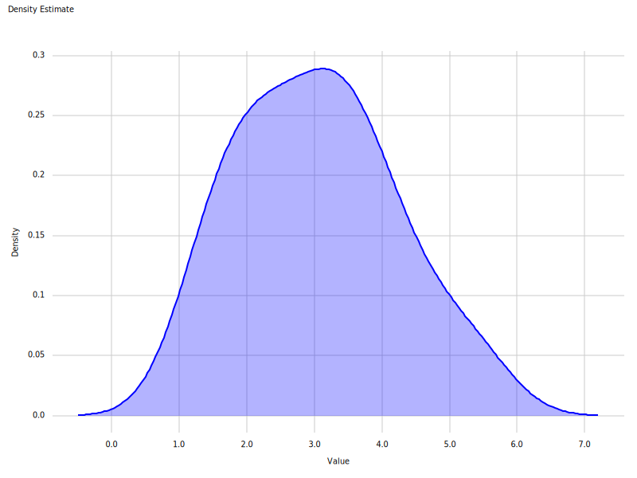

### Density Plot with Color Grouping

```bash
cat examples/demographics.csv | gramgraph 'aes(x: height, color: gender) | density(alpha: 0.4) | labs(title: "Height Distribution by Gender", x: "Height (cm)", y: "Density") | theme_minimal()' --format svg > examples/density_grouped.svg
```

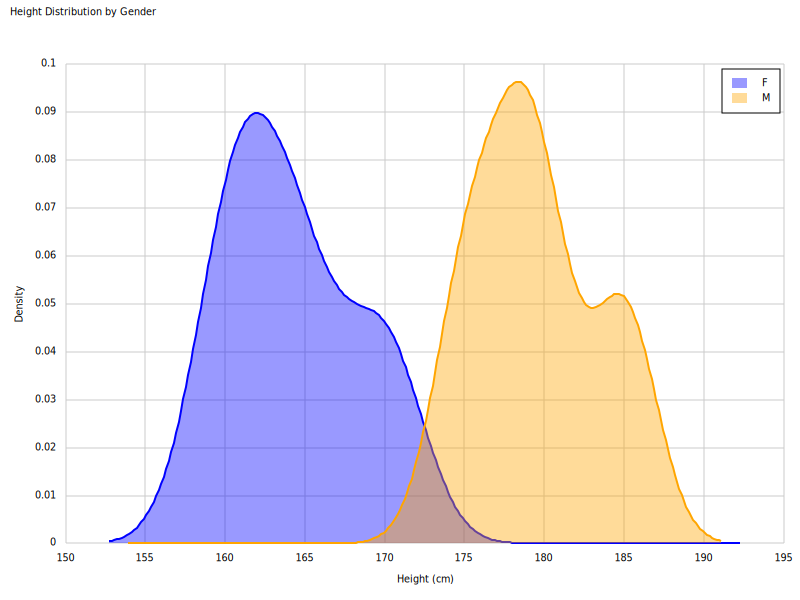

### Heatmap

```bash
cat examples/heatmap_data.csv | gramgraph 'aes(x: x, y: y, fill: value) | heatmap() | labs(title: "Weekly Activity Heatmap", x: "Day", y: "Time of Day") | theme_minimal()' --format svg > examples/heatmap.svg
```

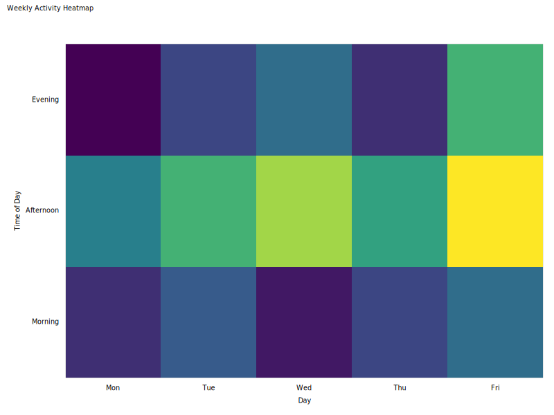

### Reverse Scale

```bash
cat examples/timeseries.csv | gramgraph 'aes(x: time, y: value, color: series) | line() | labs(title: "Reverse Time Axis") | scale_x_reverse()' --format svg > examples/scale_reverse.svg
```

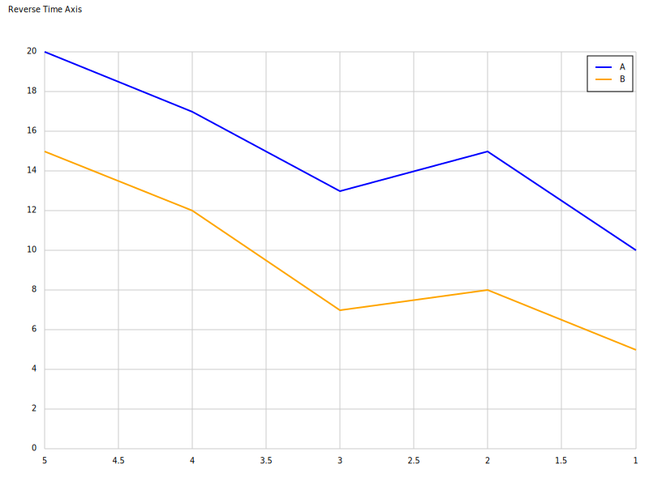

### Custom Theme with Element Functions

```bash
cat examples/timeseries.csv | gramgraph 'aes(x: time, y: value, color: series) | line() | labs(title: "Custom Styled Chart") | theme(plot_title: element_text(size: 24, color: "#2E86AB"), panel_grid_minor: element_blank(), axis_line: element_blank())' --format svg > examples/theme_custom.svg
```

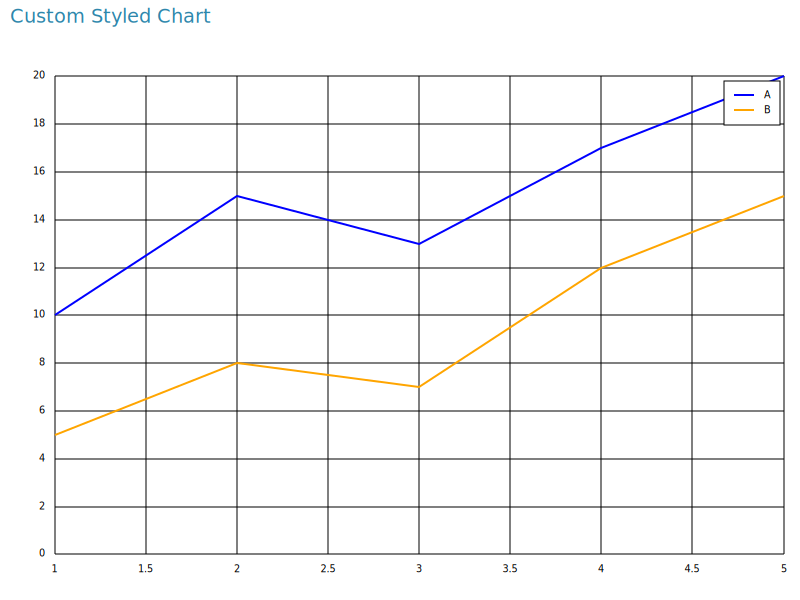

### Dark Theme Example

```bash
cat examples/demographics.csv | gramgraph 'aes(x: height, y: weight, color: gender) | point(size: 5) | labs(title: "Dark Theme Example") | theme(plot_background: element_rect(fill: "#1a1a2e"), panel_background: element_rect(fill: "#16213e"), text: element_text(color: "#eaeaea"), axis_text: element_text(color: "#a0a0a0"), panel_grid_minor: element_line(color: "#6e6e6e", width: 0.5), panel_grid_major: element_line(color: "white", width: 0.5), axis_line: element_line(color: "#ffffff", width: 1))' --format svg > examples/theme_dark.svg
```

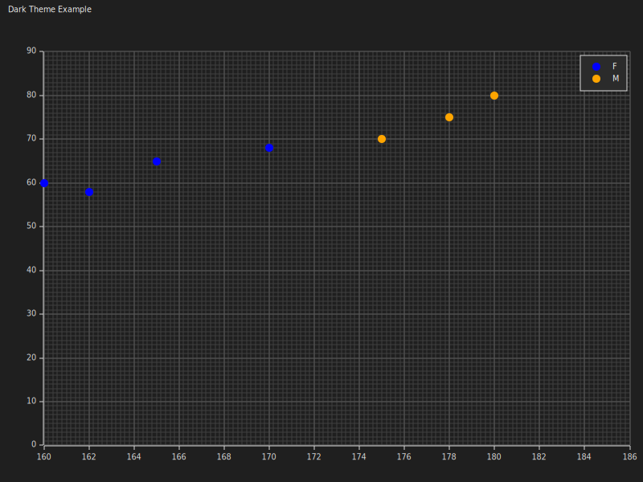

### Merged Themes

```bash
cat examples/financials.csv | gramgraph 'aes(x: quarter, y: amount, color: type) | bar(position: "dodge") | labs(title: "Merged Theme Example") | theme_minimal() | theme(plot_title: element_text(size: 20, face: "bold"))' --format svg > examples/theme_merged.svg
```


### Bold Axis Labels

```bash
cat examples/financials.csv | gramgraph 'aes(x: quarter, y: amount, color: type) | bar(position: "dodge") | labs(title: "Bold Axis Labels") | theme(axis_text: element_text(face: "bold", size: 14))' --format svg > examples/axis_bold.svg
```

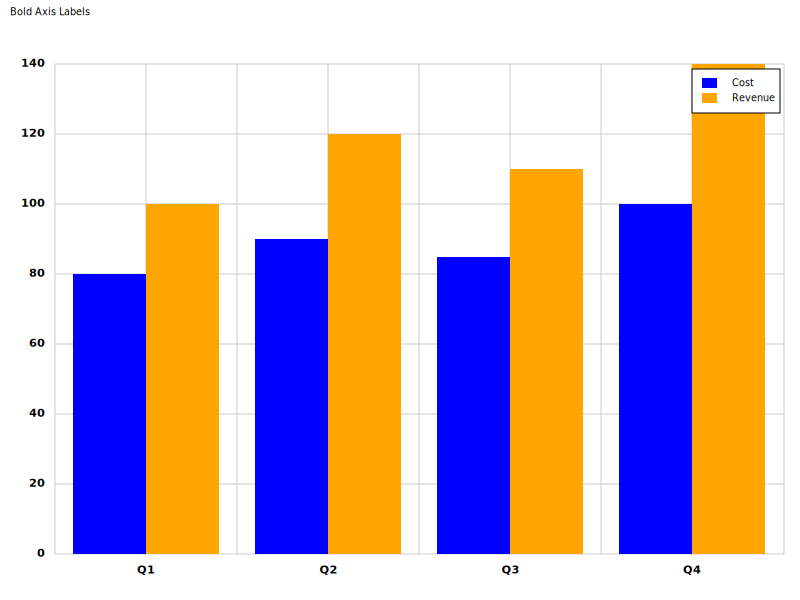

### Rotated X-Axis Labels

```bash
cat examples/financials.csv | gramgraph 'aes(x: quarter, y: amount, color: type) | bar(position: "dodge") | labs(title: "Rotated X-Axis Labels") | theme(axis_text: element_text(angle: 90, size: 12))' --format svg > examples/axis_rotated.svg
```


### Hidden Ticks

```bash
cat examples/timeseries.csv | gramgraph 'aes(x: time, y: value, color: series) | line() | labs(title: "Clean Look - No Ticks") | theme_minimal() | theme(axis_ticks: element_blank())' --format svg > examples/axis_no_ticks.svg
```

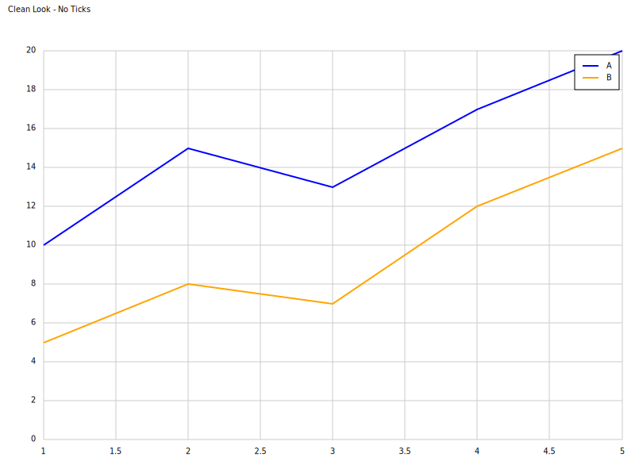

### Fully Styled Axes

```bash
cat examples/regional_sales.csv | gramgraph 'aes(x: region, y: sales, color: product) | bar(position: "dodge") | labs(title: "Fully Styled Axes") | theme(axis_text: element_text(face: "bold", angle: 90, color: "#2E86AB", size: 11), axis_line: element_line(color: "#333333", width: 2))' --format svg > examples/axis_styled.svg
```

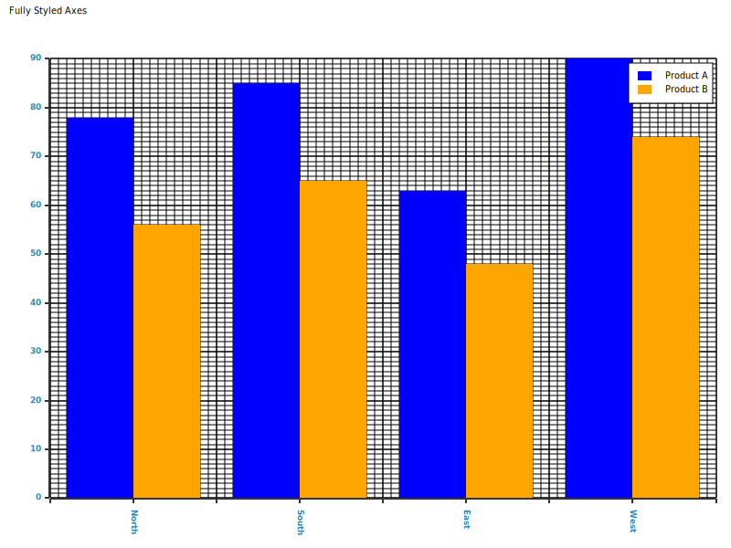

### Variable Injection

Use `-D` / `--define` to inject variables into your DSL at runtime. Variables use the `$name` syntax.

```bash
cat examples/timeseries.csv | gramgraph 'aes(x: $xcol, y: $ycol, color: series) | line() | labs(title: $title)' -D xcol=time -D ycol=value -D title="Variable Injection Example" --format svg > examples/variable_aes.svg
```

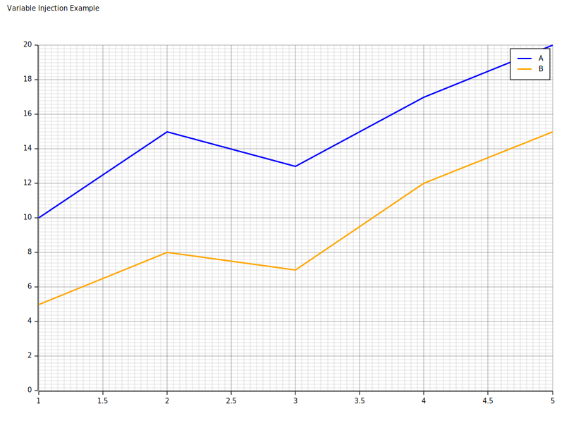

Variables work in aesthetics, geometries, and labels:

```bash
cat examples/demographics.csv | gramgraph 'aes(x: height, y: weight) | point(color: $color, size: $size) | labs(title: "Styled with Variables")' -D color=blue -D size=8 --format svg > examples/variable_geom.svg
```

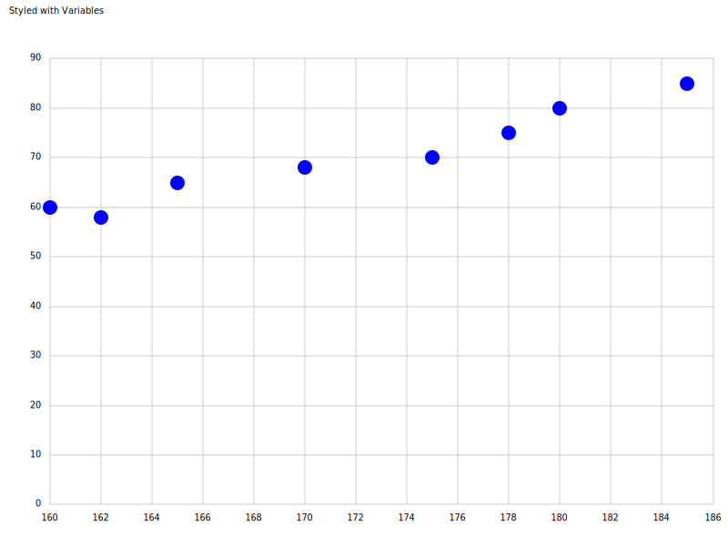

## Installation

```bash
cargo install --path .
```
